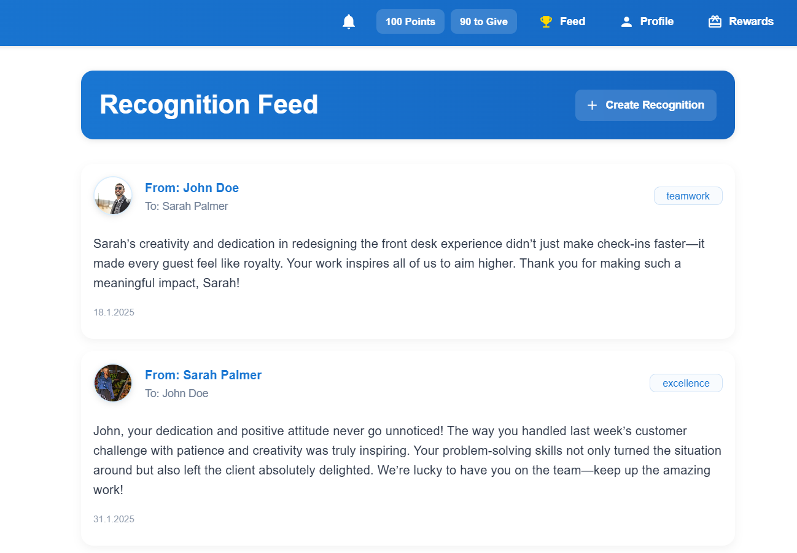
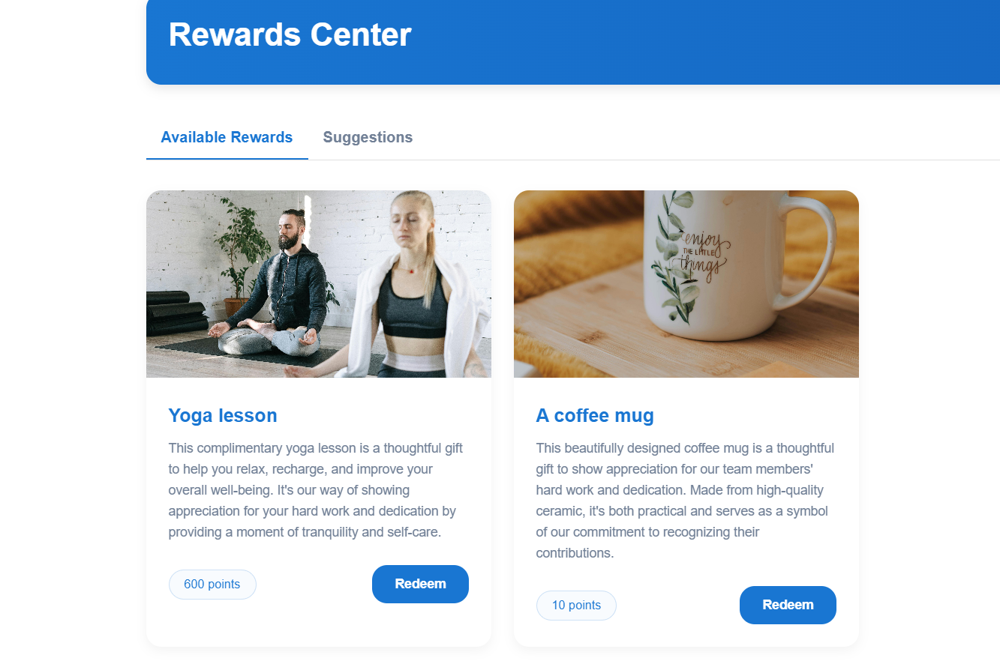
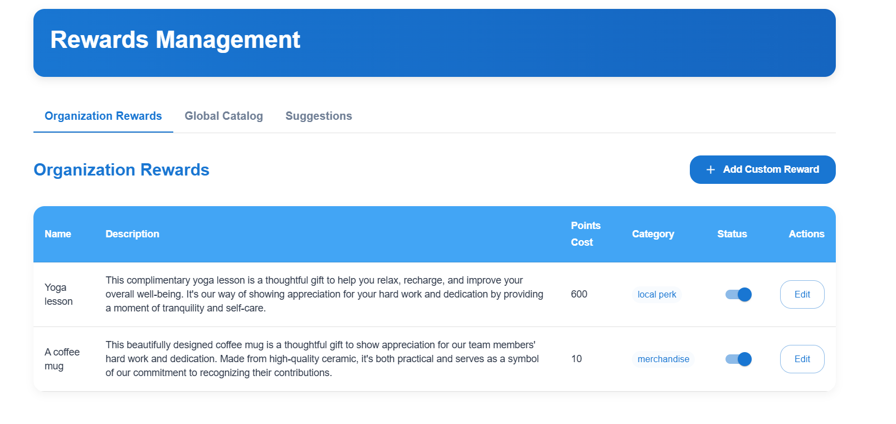
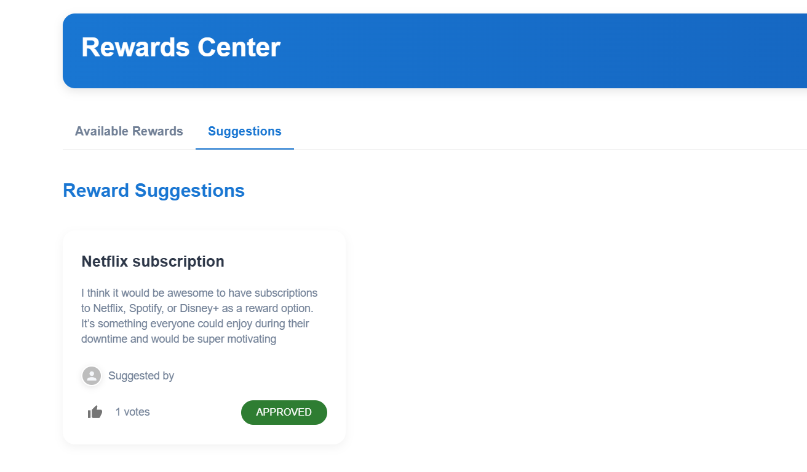

# Employee Recognition System

<div align="center">
  
  <p><em>Comprehensive employee recognition and rewards management platform</em></p>
</div>

A comprehensive, full-stack employee recognition and rewards management platform built with React, TypeScript, and Keycloak authentication. This application enables organizations to create, manage, and track employee recognitions with a complete points-based reward system, including admin management, community features, and detailed analytics.

## 🚀 Features

### 🔐 Authentication & Security
<div align="center">
  
  <p><em>Secure Keycloak authentication with modern UI</em></p>
</div>

- **User Authentication**: Secure login with Keycloak integration
- **Role-based Access**: Different permissions for admin and regular users

### 📝 Recognition Management
<div align="center">
  
  <p><em>Main dashboard with recognition feed and creation interface</em></p>
</div>

- **Recognition Management**: Create and view employee recognitions
- **Points System**: Award points for different types of recognitions
- **Real-time Updates**: Live recognition feed with instant updates

### 👤 User Profiles & Management
<div align="center">
  
  <p><em>Comprehensive user profiles with image upload and achievements</em></p>
</div>

- **User Profiles**: Manage user information and profile images
- **Profile Images**: Upload and manage user avatars
- **Achievements**: Track user accomplishments and points

### 📱 Responsive Design
<div align="center">
  
  <p><em>Fully responsive design that works on all devices</em></p>
</div>

- **Responsive Design**: Modern UI that works on all devices
- **Mobile-First**: Optimized for mobile and tablet experiences

### 🎁 Rewards Management System
<div align="center">
  
  <p><em>Comprehensive rewards catalog with point-based redemption system</em></p>
</div>

- **Rewards Catalog**: Browse and redeem rewards using earned points
- **Point Redemption**: Convert recognition points into tangible rewards
- **Reward Suggestions**: Community-driven reward recommendations

### 🛠️ Admin Management
<div align="center">
  
  <p><em>Administrative interface for managing rewards and system settings</em></p>
</div>

- **Admin Dashboard**: Comprehensive management interface
- **Reward Management**: Create, edit, and manage reward items
- **System Administration**: User management and system configuration

### 💡 Community Features
<div align="center">
  
  <p><em>Community-driven reward suggestions and feedback system</em></p>
</div>

- **Reward Suggestions**: Users can suggest new rewards
- **Community Feedback**: Collaborative reward management
- **Engagement Features**: Interactive community participation

## 🛠️ Tech Stack

<div align="center">
  
  <p><em>Modern technology stack with React, TypeScript, and Keycloak</em></p>
</div>

### Frontend
- **React 18** with TypeScript
- **Material-UI (MUI)** for modern UI components
- **Vite** for fast development and building
- **React Router** for navigation
- **Axios** for API communication
- **Keycloak-js** for authentication

### Backend Integration
- **RESTful API** integration with comprehensive endpoints
- **JWT Token** authentication with role-based access
- **File upload** support for profile images and reward assets
- **CORS** enabled for cross-origin requests
- **Admin Management** APIs for system administration
- **Rewards System** APIs for catalog and redemption management

## 🏗️ Architecture

<div align="center">
  
  <p><em>System architecture showing frontend, backend, and authentication flow</em></p>
</div>

## 📋 Prerequisites

Before running this application, make sure you have:

- **Node.js** (v16 or higher)
- **npm** or **yarn**
- **Keycloak Server** running (for authentication)
- **Backend API** running (for data management)

## 🚀 Getting Started

### 1. Clone the Repository

```bash
git clone <repository-url>
cd employee-recognition
```

### 2. Install Dependencies

```bash
npm install
```

### 3. Environment Configuration

Create a `.env.local` file in the root directory:

```env
VITE_API_BASE_URL=http://localhost:5000
VITE_KEYCLOAK_URL=http://localhost:8080
VITE_KEYCLOAK_REALM=employee-recognition
VITE_KEYCLOAK_CLIENT_ID=employee-recognition-frontend
```

### 4. Keycloak Setup

Run the Keycloak setup script to configure the frontend client:

```bash
node setup-keycloak.js
```

Or set environment variables for non-interactive setup:

```bash
$env:KEYCLOAK_USERNAME="admin"
$env:KEYCLOAK_PASSWORD="admin"
node setup-keycloak.js
```

### 5. Start the Development Server

```bash
npm run dev
```

The application will be available at `http://localhost:3000`.

## 🏗️ Project Structure

```
src/
├── components/          # Reusable UI components
│   ├── auth/           # Authentication components
│   ├── dashboard/      # Dashboard-specific components
│   ├── recognition/    # Recognition-related components
│   └── profile/        # Profile management components
├── hooks/              # Custom React hooks
├── lib/                # Utility libraries
│   ├── auth/           # Authentication utilities
│   ├── types/          # TypeScript type definitions
│   └── utils/          # Helper functions
├── pages/              # Page components
└── App.tsx             # Main application component
```

## 🔧 Available Scripts

- `npm run dev` - Start development server
- `npm run build` - Build for production
- `npm run preview` - Preview production build
- `npm run lint` - Run ESLint

## 🔐 Authentication

This application uses Keycloak for authentication. Users must:

1. Have a valid Keycloak account
2. Be assigned to the appropriate realm
3. Have the necessary roles for the application

## 📱 Features Overview

### Dashboard
<div align="center">
  
  <p><em>Interactive dashboard with real-time recognition feed</em></p>
</div>

- View all recognitions in a feed
- Create new recognitions
- Real-time updates

### Recognition Management
<div align="center">
  
  <p><em>Complete recognition creation and management system</em></p>
</div>

- Create recognitions with categories (Teamwork, Innovation, Excellence, Customer Service)
- Award points (1-10 points)
- Add personalized messages
- Select recipients from organization

### Rewards System
<div align="center">
  
  <p><em>Point-based rewards catalog and redemption system</em></p>
</div>

- Browse comprehensive rewards catalog
- Redeem rewards using earned points
- Track redemption history
- Community-driven reward suggestions

### Admin Management
<div align="center">
  
  <p><em>Administrative interface for system management</em></p>
</div>

- Manage rewards and catalog items
- User administration and permissions
- System configuration and settings
- Analytics and reporting

### User Management
<div align="center">
  
  <p><em>Community features and user engagement</em></p>
</div>

- User profiles with image upload
- Community reward suggestions
- Interactive feedback system
- Achievement tracking

## 🎨 UI/UX Features

- **Modern Design**: Clean, professional interface
- **Responsive Layout**: Works on desktop, tablet, and mobile
- **Loading States**: Smooth loading indicators
- **Error Handling**: User-friendly error messages
- **Accessibility**: WCAG compliant components

## 🔧 Configuration

### Vite Configuration
The application uses Vite with the following proxies:
- `/api` → Backend API server
- `/uploads` → File uploads

### Keycloak Configuration
- PKCE enabled for security
- Automatic token refresh
- Secure logout handling

## 🚀 Deployment

### Build for Production

```bash
npm run build
```

### Environment Variables for Production

```env
VITE_API_BASE_URL=https://your-api-domain.com
VITE_KEYCLOAK_URL=https://your-keycloak-domain.com
VITE_KEYCLOAK_REALM=your-realm
VITE_KEYCLOAK_CLIENT_ID=your-client-id
```

## 🤝 Contributing

1. Fork the repository
2. Create a feature branch
3. Make your changes
4. Add tests if applicable
5. Submit a pull request

## 📄 License

This project is licensed under the MIT License.

## 🆘 Support

For support and questions:
- Check the documentation
- Review the code comments
- Open an issue in the repository

## 🎯 Future Enhancements

- [ ] Real-time notifications
- [ ] Advanced analytics dashboard
- [ ] Mobile app development
- [ ] Integration with HR systems
- [ ] Advanced reporting features